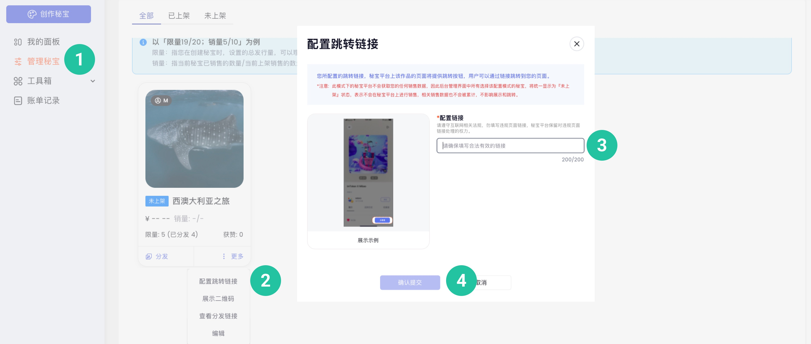
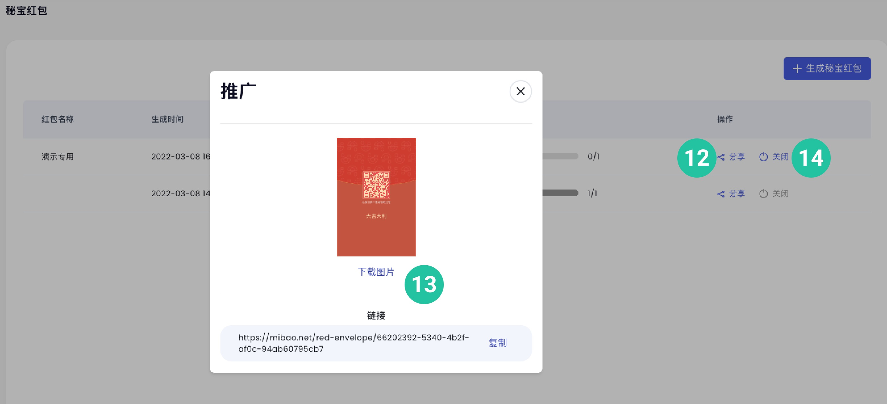

# 快速创作分发

## 在秘宝创作者平台进行创作和分发

### 1. 注册[秘宝创作者账户](https://v.mibao.net/zh/register)
功能简介：如果您从未注册过秘宝创作者账户，可先注册成为秘宝创作者。

操作流程：

1. 进入[秘宝创作者账户网页](https://v.mibao.net/zh/register)* 输入**邮箱**

2. 点击**发送验证码**

3. 登录邮箱查看验证码

4. 输入验证码

5. 设置**密码**

6. 勾选协议

7. 点击**立即注册**
	
 

### 2. 登录[秘宝创作者账户](https://v.mibao.net/zh/login)
功能简介：秘宝创作者账户注册完成后，您可以随时登录账户。

操作流程：

1. 打开[秘宝创作者账户网页](https://v.mibao.net/zh/login)

2. 输入**邮箱**

3. 输入**密码**

4. 点击**登录**

### 3. 设置[创作者公开信息](https://v.mibao.net/zh/profile/edit)：
功能简介：在秘宝创作者平台完成注册后，必须首先设置创作者公开信息，完成设置后才可以进行后续操作。
	
操作流程：

1. 上传**头像**

2. 填写**用户名**

3. 填写**个人简介**

4. 上传**主页封图**

5. 上传**官方网站**

6. 上传**邮箱地址**

7. 上传**社交媒体地址**

如需修改：暂不支持修改个人资料，我们正在努力开发修改功能中。

### 4. 申请[加 V 认证](https://internal.nervina.cn/zh/auth/verification)

如微博账号有 V 认证，请在微博中用该账号私信 [Nervina Labs 官方微博账号](https://www.weibo.com/nervinalabs)，说明申请加 V 的来意并提供您在秘宝创作中心的**注册邮箱**，我们将在24小时内回复您。

### 5. 创作秘宝
功能简介：选择您要创建的秘宝类型，秘宝目前支持图片、音频、视频、3D格式。

#### 5.1 图片格式

操作流程：

1. 输入名字

2. 输入文件地址，或上传文件（支持 PNG, JPG, JPEG, GIF, WEBP, SVG, 文件大小不超过20M）

3. 设置是否限量发行（支持不限量，或限量）

4. 输入简介

5. 设置**卡背信息**（卡背是秘宝的创新功能，仅秘宝创作者和持有人可以看到卡背内容）

6. 点击确认

如需修改：秘宝信息30天内只能修改一次，媒体信息、类别、卡背信息、上架信息可修改，其他信息不可修改。

#### 5.2 音频格式

操作流程：

1. 输入专辑/作品名称

2. 输入文件地址，或上传音频文件（支持 MP3, 单个文件大小不超过 20M；支持上传10首作品）

3. 设置用户播放权限（支持所有人均可播放，或持有人才可播放）

4. 设置作品封面（支持PNG, JPG, JPEG, GIF, WEBP, SVG, 图片分辨率建议72dpi，大小不超过 5M）

5. 设置是否限量发行（支持不限量，或限量）

6. 输入简介

7. 设置**卡背信息**（卡背是秘宝的创新功能，仅秘宝创作者和持有人可以看到卡背内容）

8. 点击确认

如需修改：秘宝信息30天内只能修改一次，媒体信息、类别、卡背信息、上架信息可修改，其他信息不可修改。

#### 5.3 视频格式

操作流程：

1. 输入名字

2. 输入文件地址，或上传文件（支持 WEBM, MP4, 文件大小不超过20M）

3. 设置作品封面（支持PNG, JPG, JPEG, GIF, WEBP, SVG, 图片分辨率建议72dpi，大小不超过 5M）

4. 设置是否限量发行（支持不限量，或限量）

5. 输入简介

6. 设置**卡背信息**（卡背是秘宝的创新功能，仅秘宝创作者和持有人可以看到卡背内容）

7. 点击确认

如需修改：秘宝信息30天内只能修改一次，媒体信息、类别、卡背信息、上架信息可修改，其他信息不可修改。

#### 5.4 3D格式

操作流程：

1. 输入名字

2. 输入文件地址，或上传文件（支持  GLB, GLTF, USDZ, 文件大小不超过20M）

3. 设置作品封面（支持PNG, JPG, JPEG, GIF, WEBP, SVG, 图片分辨率建议72dpi，大小不超过 5M）

4. 设置是否限量发行（支持不限量，或限量）

5. 输入简介

6. 设置**卡背信息**（卡背是秘宝的创新功能，仅秘宝创作者和持有人可以看到卡背内容）

7. 点击确认

如需修改：秘宝信息30天内只能修改一次，媒体信息、类别、卡背信息、上架信息可修改，其他信息不可修改。

### 6. 配置秘宝跳转链接

功能说明：您所配置的跳转链接，秘宝平台上该作品的页面将提供跳转按钮，用户可以通过链接跳转到您的页面。

操作流程：

1. 点击**管理秘宝**

2. 找到需要配置的秘宝，将鼠标移到**更多**，点击**配置跳转链接**

3. 输入配置链接

* 点击确认提交

### 7. 分发秘宝

功能说明：分发秘宝即意味着您愿意免费通过链接等方式直接将您的秘宝作品分发他人，不涉及任何交易，也不产生任何手续费或交易费用。

操作流程：

1. 点击**管理秘宝**

2. 找到需要分发的秘宝，点击分发

#### 7.1 使用地址分发秘宝

操作流程：

1. 填写接收秘宝的用户地址

2. 或通过秘宝提供的 CSV 文件模板**批量导入地址**（支持一次分发1000个地址，超过1000个地址时，建议分多次分发）

3. 点击一键分发

#### 7.2 使用链接分发秘宝

操作流程：

1. 点击**新增分发链接**

2. 输入链接数量

3. 点击确认

4. 复制分发链接

5. 下载分发二维码

6. 下载领取表（领取表是包含分发链接和领取码的 CSV 文件）

### 8. 收集用户地址

功能说明：通过链接或二维码快速收集用户地址到地址包，后续分发秘宝时可直接导入地址包来进行批量分发。

操作流程：

1. 点击工具箱

2. 点击地址收集

3. 点击新增地址包

4. 输入地址包名称

5. 输入宣传文案

6. 点击**生成地址包**

7. 点击**显示二维码**或**拷贝URL**

8. 将二维码或URL 通过微信等方式发给用户

9. 用户填写地址后，点击**下载**获取 CSV 文件

### 9. 发起兑换活动

功能说明：设置兑换活动，可以吸引持有秘宝的用户来参与兑换奖品，也可以吸引想要奖品的用户去获取秘宝。

操作流程：

1. 点击工具箱

2. 点击兑换中心

3. 点击发起兑换活动

4. 设置活动基本信息（包括活动名称、活动简介）

5. 设置活动兑换规则（可参与兑换的秘宝；参与兑换的秘宝数量；是否销毁兑换成功的秘宝）

6. 设置活动奖品信息（奖品份数；奖品类型，包括指定秘宝、随机秘宝、手动承兑）

7. 点击**发布兑换活动**

8. 点击推广，获取推广链接

9. 点击**下载二维码**，**复制链接**，将活动发送给用户

10. 点击关闭，可关闭兑换活动

### 10. 生成秘宝红包

功能说明：生成秘宝红包，可以发送红包给用户来提高秘宝的可玩性。

操作流程：

1. 点击工具箱

2. 点击秘宝红包

3. 点击**生成秘宝红包**

4. 输入红包名称

5. 选择已创作的秘宝塞进红包（支持设置隐藏款，拥有和普通款完全不同的展示效果）

6. 设置红包个数

7. 设置红包玩法（支持普通红包、口令红包、谜语红包）

8. 填写红包祝福语

9. 上传自定义红包封面（支持 PNG, JPG, JPEG, GIF, WEBP, SVG 文件类型, 建议尺寸 1463 * 1125; 文件大小不超过5M）

10. 设置红包领取成功后的推广链接，包括文案和跳转链接

11. 点击**生成红包**

12. 点击分享，获取分享链接

13. 点击**下载图片**，**复制链接**，将红包发送给用户

14. 点击关闭，可关闭兑换活动

