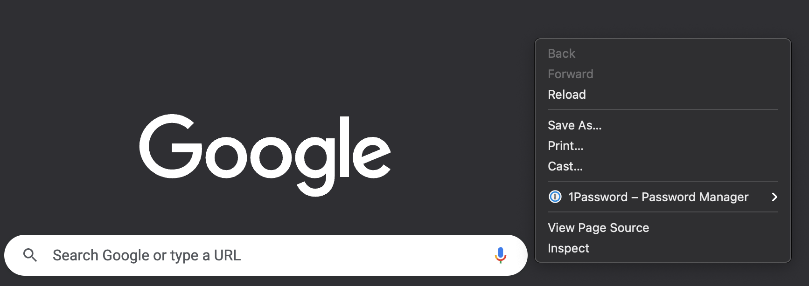
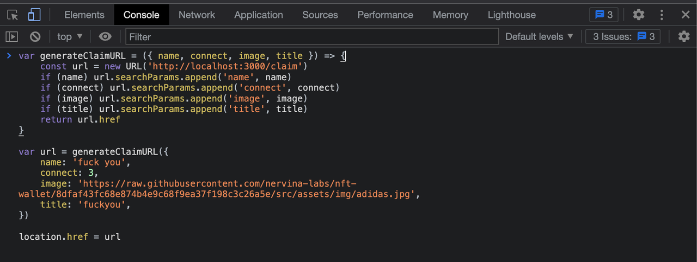

秘宝可以传入自定义参数来定义页面的显示。支持如下参数：

- title
  - 显示为网页标题，默认为“秘宝账户”，16字符 max
- image
  - 显示的背景图片 URL，领取页面在所有状态都会显示该图片，图片服务器需要支持外链。为了显示效果，建议图片宽度大于 750px，长宽比不大于 2：3，以正方形为宜。
- name
  * 替代页面中的“秘宝”字样，默认为“秘宝”，16字符 max
- connect
  * 0 代表全部显示，默认0
  * 1 显示 flashsigner
  * 2 显示 unipass
  * 4 显示 以太坊
  * 1 | 2 | 4 的bit位组合，显示不同按钮，例如 connect = 5，表示显示 flashsigner 和 以太坊，connect = 3，表示显示 flashsigner 和 unipass

例如自定义领取页面 URL 可表示为：
```bash
https://mibao.net/claim?title=青石幻城&image=xxx.jpg&name=数字藏品&connect=1
```

**为了避免生成 URL 链接的含有特殊字符（如空格）等问题，建议使用代码生成 URL：**

1. 在 Chrome 浏览器（或者 Edge 浏览器）打开一个新页面
2. 在页面空白处点击右键，点击「审查元素」（Inspect）

3. 在弹出的页面上方选择「控制台」（Console）
4. 在控制台空白处粘贴如下代码

5. 根据实际情况修改代码中参数，按下回车会跳转到秘宝
6. 在秘宝页面审核无误后，复制浏览器的 URL 地址就是最终地址

```js
const generateClaimURL = ({ name, connect, image, title }) => {
    const url = new URL('https://mibao.net/claim')
    if (name) url.searchParams.append('name', name)
    if (connect) url.searchParams.append('connect', connect)
    if (image) url.searchParams.append('image', image)
    if (title) url.searchParams.append('title', title)
    return url.href
}

// 在这里填入你的参数
const url = generateClaimURL({
    // 显示要领取 NFT 的名字
    name: '数字藏品',
    // 显示钱包 flag
    connect: 0,
    // 领取页面显示图片连接
    image: 'https://example.com',
    // 网站显示的名字
    title: '青石幻城',
})
location.href = url
```
