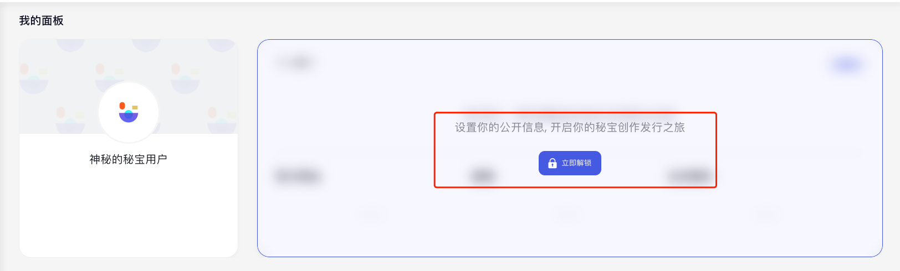
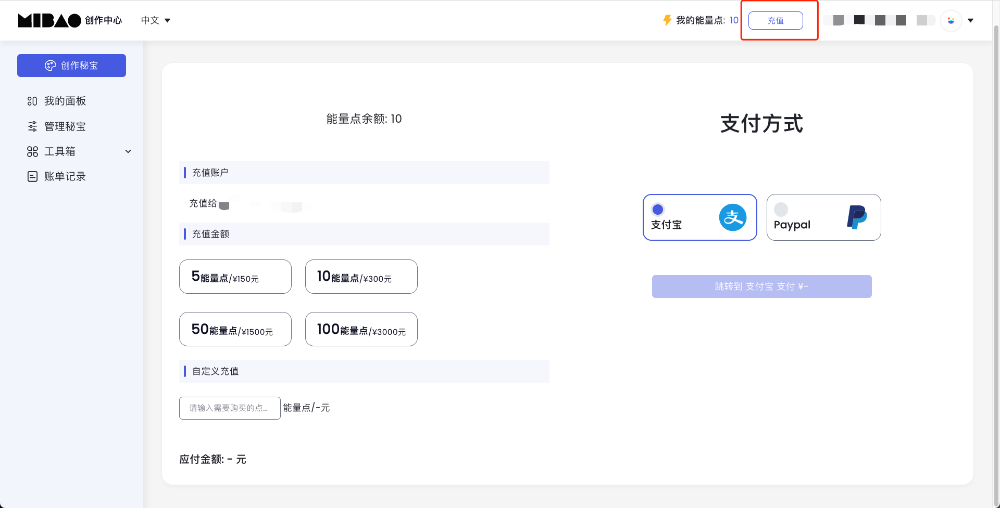

## 1.1 注册帐号

Open API 用户需要首先在秘宝创作者平台通过邮箱注册帐号，该帐号将会成为后续通过 Open API 创作和分发秘宝的创作者。

秘宝创作者平台也区分主网和测试网，对应的链接分别为：

- 主网：

  - 秘宝创作者平台： https://v.mibao.net/
  - Open API 请求地址： https://goldenlegend.nervina.cn/
  - 秘宝： https://mibao.net/explore/
  - 秘宝浏览器： https://explorer.mibao.net/

- 测试网：

  - 秘宝创作者平台： https://staging.nervina.cn/
  - Open API 请求地址： https://goldenlegend.staging.nervina.cn/
  - 秘宝： https://staging.nervina.cn/explore/
  - 秘宝浏览器： https://ckb-nft-explorer.staging.nervina.cn/

## 1.2 设置创作者公开信息

在秘宝创作者平台完成注册后，必须首先设置创作者公开信息，完成设置后才可以进行后续操作。

设置的创作者公开信息会在链上进行存储（即根据这些信息创建一个 `issuer_cell`，因此在后续文档中，我们有时候也会称创作者为 issuer），上链操作由秘宝创作者平台自动完成。

## 1.3 申请 Open API 的 key/secret

Open API 的鉴权需要使用帐号对应的 key/secret 进行签名，因此在完成上述操作之后，如果需要使用 Open API，可以发送邮件到 biz@nervina.io 申请 Open API 的 key/secret，邮件正文中必须包含申请帐号的注册邮箱。收到申请邮件且审核通过后，我们会尽快为您生成 key/secret，并通过邮件进行回复。

## 1.4 能量点充值

秘宝创作者平台分发 NFT 需要消耗能量点（创作秘宝免费，每分发一个 NFT 需要消耗 1 点能量点），因此在进行下一个操作前你需要充值相应数量的能量点。

您可以直接在秘宝创作者平台的页面直接进行购买，付款后能量点会直接充值到您的帐号。

