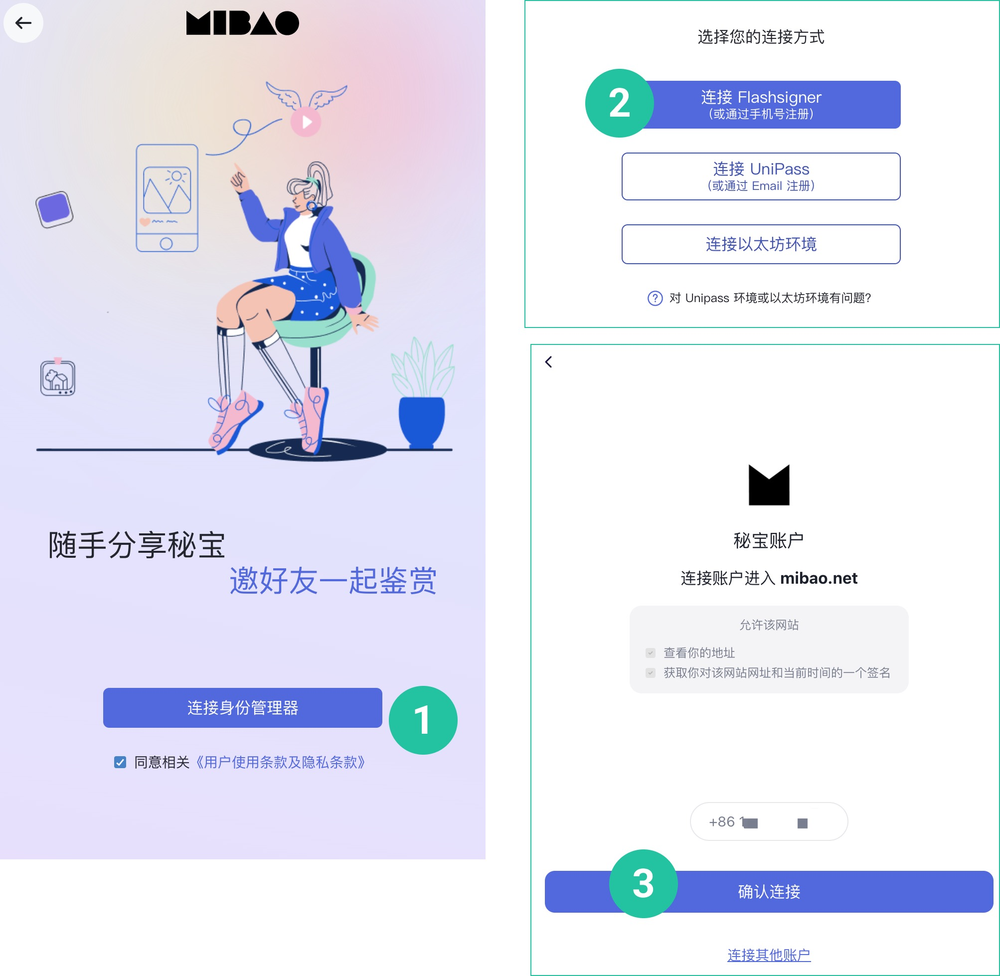

# 玩转数字藏品

## 注册秘宝账户
	
功能说明：您可使用手机号注册秘宝账户
	
操作流程：

1. 打开[秘宝账户](https://mibao.net/login),在登录页勾选协议，点击**连接身份管理器**

2. 选择**连接Flashsigner**

3. 输入手机号，点击按钮进行验证，点击下一步

4. 输入6位验证码

5. 输入密码，点击下一步（建议至少8位，含有数字、大写字母、小写字母）

6. 保存您的账户二维码到手机或者电脑**（请保存原图，不要截图保存。二维码是您重置密码、恢复账户的唯一方式）**

7. 点击下一步，进入秘宝

## 2. 登录秘宝账户

功能说明：秘宝账户注册成功后，您可以随时登录账户
	
操作流程：
	
1. 打开[秘宝账户](https://mibao.net/login)

2. 在登录页勾选协议，点击**连接身份管理器**
	
3. 选择**连接Flashsigner**
	
4. 点击**确认连接**

## 3. 领取秘宝

功能说明：您可以使用秘宝领取码领取数字藏品，如果您未注册或登录秘宝账户，需要先完成注册和登录
	
操作流程：进入[秘宝领取页面](https://mibao.net/claim)，输入领取码，点击按钮进行验证，点击**确认领取**

## 4. 转让秘宝

功能说明：您可以免费转让您持有的秘宝至其他秘宝账户。转让意味着您的秘宝将会在区块链上产生一笔转让记录，需要等待 1 分钟左右
	
操作流程：
		
1. 进入[秘宝账户](https://mibao.net/home))，找到并点击要转让的秘宝，点击**转让**
		
2. 输入接收方的地址，点击**转让**
		
3. 点击**确认**
		
4. 点击**签名**

##5. 参与兑换活动

功能说明：秘宝官方及创作者会不定期举行秘宝兑换活动，持有秘宝的朋友可以多多关注
	
操作流程：

1. 进入[秘宝兑换中心页面](https://mibao.net/redeem)，点击**查看奖品**，即可查看活动奖品的详细信息

2. 点击**可兑换**，如果您持有符合活动兑换条件的秘宝，可以看到对应的活动

3. 点击**立即兑换**，即可完成奖品兑换

## 6. 使用秘宝红包

功能说明：您可以流畅地使用红包功能，增加秘宝收藏的愉悦体验
	
操作流程：
		
1. 打开[秘宝红包页面](https://mibao.net/red-envelope)，点击**普通红包**或**谜语红包**，进入红包编辑页面
		
2. 选择要塞进红包的秘宝，点击确定
		
3. 输入红包个数，红包个数不允许超过塞进红包的秘宝个数
		
4. 填写祝福语，点击生成秘宝红包
		
5. 长按图片保存红包，或复制分享链接，即可分享给朋友

	
